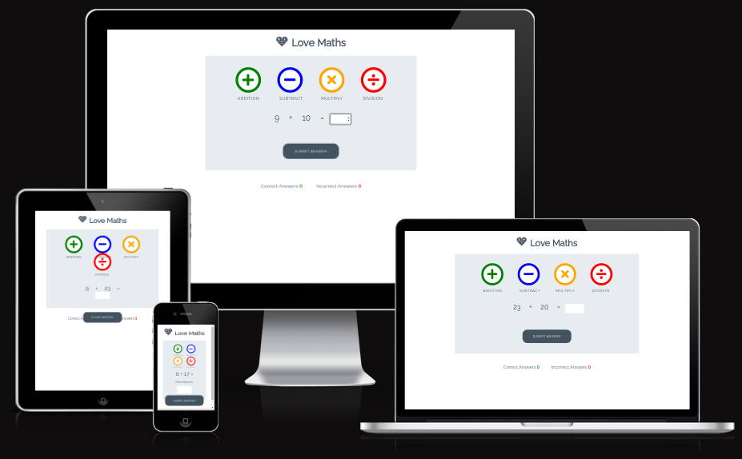
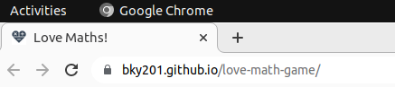
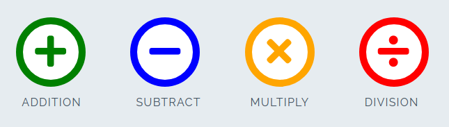
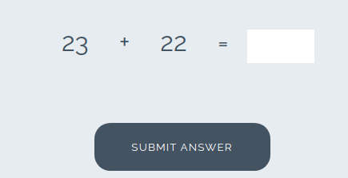
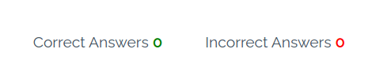

# love-math-game

love maths game is a website that allows visitors to play game by calculating the result of two numbers. The game contains four type of buttons inorder for the user to choose between the game type, and once the user clicked a button he will  be prompted to the game to play. The game records the correct and incorrect results of the user obtained during the game play. The game can help the user to improve their maths skills and level. View the live site [here](https://bky201.github.io/love-math-game/). 

## Existing Features

### Main Page
* Favicon 
  * A favicon brand is a heart with maths operators within the hear image.

* The Love Maths Logo and Heading
  * Featured at the top of the page, the Love Maths logo and heading is easy to see for the user. Upon viewing the page, the user will be able to see the name of the game.

  

* The Game Area
  * This section will allow the user to play the maths game. The user will be able to easily see icons for addition, subtraction, multiplication, and division games.
  * The user will be able to select the type of maths game they will be playing by clicking on the different icons.

* The Question section
  * The question section is where the user will be able to see the elementary arithmetic question to answer as part of the game. The user will be able answer the questions in the answer box provide
  * The user will be able to submit their answer and a pop-up will make it known to the user if they answered correctly.

* The Score Area
  * This section will allow the user to see exactly how many correct and incorrect answers they have provided.

### Features Left to Implement

* Adding another feature idea

## Design Section Rough Sketches
* Main Page

### Innovative tools and systems

* Visual Studio Code
  * Visual Studio Code IDE tool was utilized in building the website. 
* HTML
  * The primary language utilized in constructing the Website's structure was HTML.
* CSS
  * The styling of the Website was designed by utilizing an separate CSS file.
* Git
  * The source code of the Website was regularly committed and pushed during its development using Git.  
* GitHub
  * The source code of the website is accessible on GitHub, and it has been uploaded using Git Pages.  
* Favicon.io
  * The favicon files were generated using https://favicon.io/favicon-converter/.  
* Font Awesome
  * The game button icons obtained from https://fontawesome.com/.  

## Testing

### Web Page Responsiveness

To guarantee responsiveness, all pages underwent thorough testing on screen sizes starting from 320px and above, following the criteria for responsive design. This testing was conducted on Chrome, Edge, and Firefox.
The foloowing testing method was implemented.
1. Launch a web browser and visit Aerobics Club.
2. Access the developer tools by right-clicking and selecting "Inspect."
3. Switch to the responsive mode and reduce the width to smaller size.
4. Adjust the zoom level.
5. Click and drag the responsive window to its maximum width.

The Expected Output:

The website exhibits responsiveness across all screen sizes, ensuring that no images appear stretched. There is no horizontal scroll present, and all elements are properly arranged without any overlapping.

The Actual Output:

The website generally performed as anticipated, although there were some issues specifically observed when switching to smaller screen views. 

