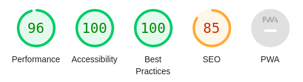
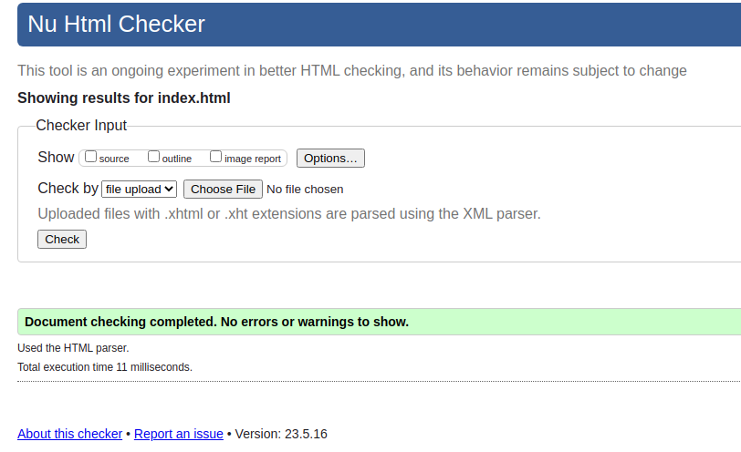
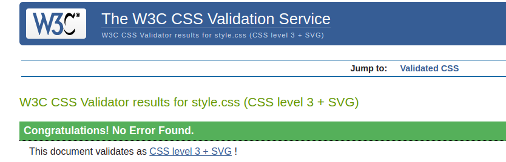
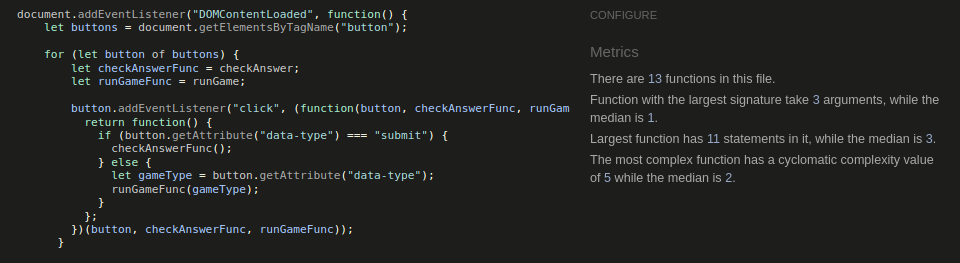

# love-math-game

love maths game is a website that allows visitors to play game by calculating the result of two numbers. The game contains four type of buttons inorder for the user to choose between the game type, and once the user clicked a button he will  be prompted to the game to play. The game records the correct and incorrect results of the user obtained during the game play. The game can help the user to improve their maths skills and level. View the live site [here](https://bky201.github.io/love-math-game/). 

## Existing Features

### Main Page
* Favicon 
  * A favicon brand is a heart with maths operators within the hear image.

* The Love Maths Logo and Heading
  * Featured at the top of the page, the Love Maths logo and heading is easy to see for the user. Upon viewing the page, the user will be able to see the name of the game.

  

* The Game Area
  * This section will allow the user to play the maths game. The user will be able to easily see icons for addition, subtraction, multiplication, and division games.
  * The user will be able to select the type of maths game they will be playing by clicking on the different icons.

* The Question section
  * The question section is where the user will be able to see the elementary arithmetic question to answer as part of the game. The user will be able answer the questions in the answer box provide
  * The user will be able to submit their answer and a pop-up will make it known to the user if they answered correctly.

* The Score Area
  * This section will allow the user to see exactly how many correct and incorrect answers they have provided.

### Features Left to Implement

* Adding another feature idea

## Design Section Rough Sketches
* Main Page

### Innovative tools and systems

* Visual Studio Code
  * Visual Studio Code IDE tool was utilized in building the website. 
* HTML
  * The primary language utilized in constructing the Website's structure was HTML.
* CSS
  * The styling of the Website was designed by utilizing an separate CSS file.
* Git
  * The source code of the Website was regularly committed and pushed during its development using Git.  
* GitHub
  * The source code of the website is accessible on GitHub, and it has been uploaded using Git Pages.  
* Favicon.io
  * The favicon files were generated using https://favicon.io/favicon-converter/.  
* Font Awesome
  * The game button icons obtained from https://fontawesome.com/.  

## Testing

### Web Page Responsiveness

To guarantee responsiveness, all pages underwent thorough testing on screen sizes starting from 320px and above, following the criteria for responsive design. This testing was conducted on Chrome, Edge, and Firefox.
The foloowing testing method was implemented.
1. Launch a web browser and visit love math game website.
2. Access the developer tools by right-clicking and selecting "Inspect."
3. Switch to the responsive mode and reduce the width to smaller size.
4. Adjust the zoom level.
5. Click and drag the responsive window to its maximum width.

The Expected Output:

The website exhibits responsiveness across all screen sizes, ensuring that no images appear stretched. There is no horizontal scroll present, and all elements are properly arranged without any overlapping.

The Actual Output:

The website generally performed as anticipated, although there were some issues specifically observed when switching to smaller screen views.

### Accessibility

Throughout the development process and during the final testing of the deployed website, the Wave Accessibility tool was employed to conduct accessibility testing. The testing procedure focused on verifying that the website adhered to the following criteria:

1. Proper labeling and alternative text: All elements, such as form controls and images, were appropriately labeled and included descriptive alternative text.

2. Color contrast: Sufficient color contrast was ensured between text and background colors to enhance readability for individuals with visual impairments.

3. Keyboard accessibility: The website was tested to ensure that all interactive elements, menus, and navigation could be accessed and operated solely using a keyboard.

4. Heading structure: The headings were organized in a logical hierarchy, aiding in content navigation and comprehension.

5. Link accessibility: Links were clearly identified and provided meaningful text to indicate their purpose or destination.

6. Form validation and error handling: Form inputs were validated and clear error messages were provided to assist users in correcting any input errors.

By employing the Wave Accessibility tool and adhering to these criteria, the website aimed to enhance its accessibility and ensure a user-friendly experience for individuals with disabilities.

### Lighthouse 

### Website Validation Test 

#### HTML Validator
* HTML
  * No errors were returned when passing through the official [W3C validator](https://validator.w3.org/#validate_by_uri).

#### CSS Validator
* CSS
  * No errors were found when passing through the official [(Jigsaw) validator](https://jigsaw.w3.org/css-validator/).

#### JS Validator
* Javascript
  * No errors were found when passing through the official [Jshint validator](https://jshint.com/).

## Unfixed Bugs

* Text overlapping during small screen size.

## Deployment

### Repository

The website was developed using the Visual Studio code editor and uploaded to the remote repository named 'love-math-game' on GitHub.

During the development process, the following Git commands were utilized to push the code to the remote repository:

1. `git add [file]` command was utilized to include the file(s) in the staging area prior to committing them.
2. `git commit -m [commit message]` command was employed to record and save the changes made to the local repository, preparing them for the final step.
3. `git push` command was utilized to upload all committed code to the remote repository on GitHub.

### Hosting on Github Pages

* The website was successfully published on GitHub Pages. The deployment process involved the following steps:
  * Navigate to the "Settings" tab within the GitHub repository.
  * Navigate to pages on the left menu
  * Navigate to source section and select brach "main" and click "save"
  * Once published successfully, after waiting for some time a live link will be generated as follow:
  
  Your site is live at https://bky201.github.io/love-math-game/

### Clone the repository code locally

To create a local copy of the repository code by cloning it just do the following steos:

  * Navigate to the GitHub Repository that you want to clone locally, and then click on the dropdown button labeled "Code".
  * Click on "HTTPS" and copy the link
  * Open your IDE and install git
  * On your cmd line write git clone "your https link"

## Credits
* [Code Institute Lessons](https://codeinstitute.net/de/bildungsgutschein/?utm_term=&utm_campaign=&utm_source=adwords&utm_medium=ppc&hsa_acc=8983321581&hsa_cam=16444385937&hsa_grp=134820843115&hsa_ad=592446400471&hsa_src=ytv&hsa_tgt=&hsa_kw=&hsa_mt=&hsa_net=adwords&hsa_ver=3&gclid=EAIaIQobChMI_JSK-Kne_QIViYbVCh12PA-_EAEYASAAEgKIhvD_BwE)